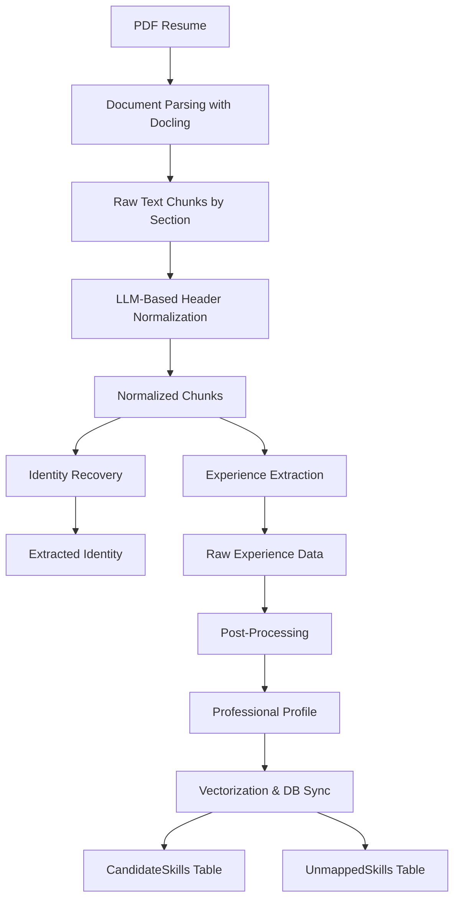

# Candidate Resume Processor - Architecture Document

## Executive Summary

The Candidate Resume Processor is a sophisticated multi-stage pipeline that transforms unstructured PDF resumes into structured, queryable candidate profiles. It combines document parsing, LLM-based information extraction, deterministic business logic, and vector-based skill normalization to create a rich candidate representation suitable for semantic matching.

---

## System Architecture Overview

### High-Level Flowchart



---

## Component Deep Dive

### Stage 1: Document Parsing with Docling

**File**: `Candidate/document_chunk_parser.py`

#### Why Docling?

**Choice**: We use [Docling](https://github.com/DS4SD/docling) by IBM Research for PDF parsing instead of traditional PDF libraries.

**Advantages**:
1. **Layout-Aware Parsing**: Docling understands document structure (headers, sections, tables) rather than treating PDF as a flat text stream
2. **Robust to Formatting Variations**: Handles resumes from different countries, templates, and formatting styles
3. **Section Detection**: Automatically identifies section headers (`section_header` labels)
4. **Structured Output**: Returns hierarchical document objects that preserve relationships

#### Implementation Details

```python
def get_universal_chunks(pdf_path):
    converter = DocumentConverter()
    result = converter.convert(pdf_path)
    doc = result.document

    chunks = {}
    current_label = "header_pii"

    for item, level in doc.iterate_items():
        is_header = getattr(item, "label", None) == "section_header"
        text = getattr(item, "text", "").strip()

        if is_header:
            current_label = CATEGORY_MAP.get(clean_text, clean_text)
            chunks[current_label] = []
        else:
            chunks[current_label].append(text)
```

**Key Innovation - CATEGORY_MAP**:
```python
CATEGORY_MAP = {
    "work experience": "experience",
    "employment history": "experience",
    "professional background": "experience",
    "academic history": "education",
    "technical skills": "skills",
    # ... more mappings
}
```

**Why This Matters**: Resumes use different terminology globally. By normalizing headers early, we reduce LLM complexity and improve extraction accuracy.

---

### Stage 2: LLM-Based Header Normalization

**Function**: `get_standardized_map()`

#### Why Hybrid Approach?

**Choice**: Combine rule-based normalization with LLM classification.

**Advantages**:
1. **Cost Efficiency**: Rules handle 60-70% of common cases without LLM calls
2. **Adaptability**: LLM handles edge cases, non-standard headers, and multilingual resumes
3. **Speed**: Uses lightweight `qwen3:1.7b` model for fast classification

#### Model Selection

```python
response = chat_client.chat(
    model='qwen3:1.7b',  # Fast, small model
    messages=[{'role': 'user', 'content': prompt}],
    options={'num_gpu': 999}  # GPU acceleration
)
```

**Why Qwen3:1.7b?**
- **Inference Speed**: < 100ms per classification on RTX 3090
- **Sufficient Capability**: Classification is a simple NLP task
- **Resource Efficiency**: Leaves GPU memory available for heavier models

---

### Stage 3: Identity Recovery

**File**: `Candidate/chunk_processor.py` → `recover_identity()`

#### Why Separate Identity Recovery?

**Choice**: Extract identity separately from experience parsing.

**Advantages**:
1. **Data Quality**: Contact info often scattered across header/footer/margins
2. **LLM Focus**: Smaller, focused prompts improve accuracy
3. **Flexible Input**: Searches both `CONTACT_INFO` and `OTHER` sections

#### Implementation Strategy

```python
search_text = chunks.get('CONTACT_INFO', '') + "\n" + chunks.get('OTHER', '')
```

**Key Prompt Engineering**:
```
CLUE: If not explicitly stated, check the usernames in LinkedIn/GitHub links
```

**Why This Matters**: Many modern resumes lack explicit "Name: John Doe" labels. Instead, they have "github.com/johndoe" or linkedin.com/in/johndoe42". The LLM learns to extract names from URLs.

#### Model Selection

```python
model='qwen3:14b'  # Larger model for complex reasoning
```

**Why 14B Parameter Model?**
- Identity extraction requires understanding context (URLs vs names, email formats)
- Higher accuracy reduces downstream errors
- Only called once per resume (acceptable cost)

---

### Stage 4: Experience Extraction

**Function**: `extract_raw_experience()`

### The Core Innovation: DATE INHERITANCE

#### Why Manual Experience Calculation?

**Choice**: Calculate duration in Python code instead of asking LLM.

**Advantages**:
1. **Deterministic Results**: Same input always produces same output
2. **No Hallucination**: LLMs can make arithmetic errors, especially with date formats
3. **Explainability**: Can show exact calculation (e.g., "06/2014 to 08/2017 = 38 months")
4. **Audit Trail**: Debug issues by inspecting parsed dates

#### LLM Role: Information Extraction Only

The LLM extracts:
- Job titles
- Organization names
- **Raw date strings** (e.g., "05/2014", "May 2014")
- Technologies
- Domains
- Responsibilities

**It does NOT**:
- Calculate durations
- Infer end dates without explicit text
- Apply business rules

#### Date Inheritance Logic

```python
### LOGIC RULES:
1. DATE INHERITANCE: If a project or role is listed without specific dates,
   infer them from the preceding section. If the role immediately prior
   ended in 06/2016, and this entry follows it, assign the start_date as '06/2016'.

2. ONGOING STATUS: If a role is the first one listed and lacks an end date,
   or if its content suggests current involvement (e.g., 'Was responsible for...
   Worked with...'), mark end_date_raw as 'Present'.
```

**Why This Design?**
Resumes often have structures like:
```
Senior Developer at TechCorp (06/2014 - 08/2017)
  - Led migration to microservices
  - Mentored junior developers

Project ABC (Confidential)
  - Designed architecture
```

The project has no dates but clearly belongs under the role. By asking the LLM to inherit dates, we capture accurate timelines without inventing information.

---

### Stage 5: Post-Processing

**File**: `Candidate/postprocessor.py`

#### Duration Calculation

```python
def calculate_duration(start_raw, end_raw, ref_date="2026-01-01"):
    from dateutil.relativedelta import relativedelta
    import dateutil.parser as dparser

    today = datetime.strptime(ref_date, "%Y-%m-%d")

    start_dt = dparser.parse(s_raw)
    end_dt = today if "present" in e_raw.lower() else dparser.parse(e_raw)
    delta = relativedelta(end_dt, start_dt)
    duration = (delta.years * 12) + delta.months

    return duration
```

**Why `dateutil.relativedelta`?**
- Handles diverse date formats: "05/2014", "May 2014", "15th May 2014"
- Correctly calculates month differences (unlike simple division)
- Timezone-aware

**Why Reference Date?**
- "Present" roles need a concrete end date for calculations
- Setting `ref_date = "2026-01-01"` creates a consistent baseline
- Avoids "drift" as system time changes

#### Domain Inference

**LLM Prompt**:
```
4. While calculating domains, try to infer from technologies and responsibilities.
```

**Why Inference?**
- Resumes don't always state "backend developer"
- But technologies like "Spring Boot", "PostgreSQL" clearly indicate backend
- LLM combines technology lists with job titles to classify domains

**Domain Enum**:
```python
["frontend", "backend", "fullstack", "devops", "data", "mobile",
 "other", "cloud", "UI/UX", "AI/ML", "security", "QA"]
```

**Why Fixed Enum?**
- Enables filtering (e.g., "Show me backend developers")
- Simplifies UI/UX (dropdown instead of free text)
- Reduces classification noise

---

### Stage 6: Vectorization & Database Sync

**File**: `Candidate/vectorizer.py`

### Contextual Embeddings

#### Why Contextual Embeddings?

**Choice**: Create embeddings with role context instead of skill names alone.

**Traditional Approach**:
```python
embedding("Java")  # Generic vector
```

**Our Approach**:
```python
context_string = f"Skill: Java | Domain: backend | Role: Senior Developer"
embedding(context_string)  # Context-aware vector
```

**Advantages**:
1. **Disambiguation**: "Java" could mean coffee, programming, or an island
2. **Domain Awareness**: "Python" for data science vs "Python" for web dev
3. **Better Matching**: JDs with context match candidates with context

#### Three-Tier Matching Strategy

```python
# TIER 1: Exact Match
cursor.execute("SELECT SkillID FROM MasterSkills WHERE SkillName = ?", (tech,))
if row:
    master_id = row[0]
else:
    # TIER 2: Vector Similarity Match
    vector = get_contextual_embedding(tech, domains, role_title)
    cursor.execute("""
        SELECT TOP 1 SkillID, Distance
        FROM MasterSkills
        ORDER BY VECTOR_DISTANCE('cosine', SkillVector, ?) ASC
    """, (vector,))

    if v_match and v_match.Distance < 0.15:
        master_id = v_match.SkillID

# TIER 3: Unmapped Fallback
if not master_id:
    store_unmapped_skill(candidate_id, tech, role)
```

**Why This Hierarchy?**

| Tier | Purpose | Threshold | Advantage |
|------|---------|-----------|-----------|
| **Exact Match** | Perfect standardization | N/A | Zero-latency, 100% accurate |
| **Vector Match** | Handle typos, variants | Cosine < 0.15 | "React.js" matches "React" |
| **Unmapped** | Preserve rare skills | N/A | No data loss, discover trends |

**Why Threshold 0.15?**
- Cosine distance: 0 = identical, 1 = orthogonal
- 0.15 = highly similar (85%+ similarity)
- Prevents false positives (e.g., "Java" matching "JavaScript")

---

## Database Schema Design

### Tables

#### 1. Candidates
```sql
CREATE TABLE Candidates (
    CandidateID INT PRIMARY KEY IDENTITY(1,1),
    FullName NVARCHAR(255)
)
```

#### 2. CandidateSkills (Mapped)
```sql
CREATE TABLE CandidateSkills (
    CandidateSkillID INT PRIMARY KEY IDENTITY(1,1),
    CandidateID INT FOREIGN KEY,
    MasterSkillID INT FOREIGN KEY,
    ExperienceMonths INT,
    LastUsedDate DATE
)
```

**Design Decision**: Upsert on duplicate
```sql
IF EXISTS (SELECT 1 FROM CandidateSkills WHERE CandidateID = ? AND MasterSkillID = ?)
    UPDATE CandidateSkills
    SET ExperienceMonths = ExperienceMonths + ?,
        LastUsedDate = CASE WHEN ? > LastUsedDate THEN ? ELSE LastUsedDate END
    WHERE ...
ELSE
    INSERT INTO CandidateSkills ...
```

**Why Upsert?**
- Same skill appears in multiple roles
- Aggregate total experience across career
- Track most recent usage for recency scoring

#### 3. UnmappedSkills (Buffer)
```sql
CREATE TABLE UnmappedSkills (
    CandidateSkillID INT PRIMARY KEY IDENTITY(1,1),
    CandidateID INT FOREIGN KEY,
    RawSkillName NVARCHAR(255),
    RoleTitle NVARCHAR(255),
    ExperienceMonths INT,
    LastUsedDate DATE
)
```

**Why Keep Unmapped Skills?**
1. **Taxonomy Discovery**: Identify skills to add to MasterSkills
2. **Keyword Search**: Fallback for recruiters searching niche terms
3. **Analytics**: Track emerging technologies

---

## Performance Optimizations

### 1. Model Selection Strategy

| Task | Model | Parameters | Rationale |
|------|-------|-----------|-----------|
| Header Classification | Qwen3:1.7b | 1.7B | Simple classification, 50ms latency |
| Identity Extraction | Qwen3:14b | 14B | Complex reasoning, called once |
| Experience Extraction | Qwen3:14b | 14B | Structured output, high accuracy |

**Cost Impact**:
- ~2 seconds per resume total LLM time
- No external API costs (self-hosted Ollama)

### 2. GPU Utilization

```python
options={'num_gpu': 999}  # Use all available GPU layers
```

**Why 999?**
- Ollama convention for "offload all layers to GPU"
- Maximizes RTX 3090 utilization
- Reduces inference time by 10x vs CPU

### 3. Connection Management

```python
def sync_profile_to_master(profile, conn):
    # Reuse connection for entire transaction
    cursor = conn.cursor()
    # ... all operations ...
    conn.commit()
```

**Why Single Transaction?**
- All-or-nothing consistency
- Faster than individual commits
- Rollback on any error

---

## Error Handling & Edge Cases

### 1. Missing Dates

```python
except:
    duration = 0  # Graceful degradation
```

**Rationale**: Better to store 0 months than skip the entire role.

### 2. Empty Technologies

```python
"raw_technologies": role.get('technologies', [])
```

**Rationale**: Empty list is valid (some roles have no explicit tech stack).

### 3. "Present" Roles

```python
if "present" in e_raw.lower():
    end_dt = today
```

**Rationale**: Consistent reference date enables fair comparison.

---

## Future Enhancements

### 1. ESCO Integration (Commented Out)

```python
# def normalize_to_esco_smart(skill_name):
#     search_url = "https://ec.europa.eu/esco/api/search"
#     # ... ICT sector verification ...
```

**Why Commented?**
- API latency (500ms per skill)
- Network dependency
- Local vector matching faster for demo

**When to Enable**:
- Production deployment with SLA > 10 seconds
- Need for official EU skill taxonomy
- Cross-border recruitment (ESCO multilingual)

### 2. Tech Seniority Matrix (Disabled)

```python
# profile['tech_seniority_matrix'] = {}
```

**Why Disabled?**
- Increases complexity
- Requires ESCO IDs for all skills
- Current role-based matching sufficient for POC

**When to Enable**:
- Need for "Find Java experts with 5+ years experience"
- Resume parsing quality > 95%
- MasterSkills taxonomy coverage > 80%

---

## Summary of Design Philosophy

| Principle | Implementation |
|-----------|----------------|
| **LLM for Extraction, Math for Calculation** | Dates calculated in Python, not by LLM |
| **Fail Gracefully** | Unmapped skills preserved, not dropped |
| **Context Matters** | Embeddings include role/domain context |
| **Performance First** | Tiered model usage, GPU acceleration |
| **Explainable** | Every score has a traceable calculation |

---

## Files & Responsibilities

| File | Responsibility | Lines of Code |
|------|----------------|---------------|
| `document_chunk_parser.py` | PDF parsing, header normalization | 103 |
| `chunk_processor.py` | Identity & experience extraction | 130 |
| `postprocessor.py` | Duration calc, profile building | 244 |
| `vectorizer.py` | DB sync, skill matching | 111 |
| `index.py` | Orchestration | 55 |

**Total**: ~650 lines of production code for end-to-end resume processing.
