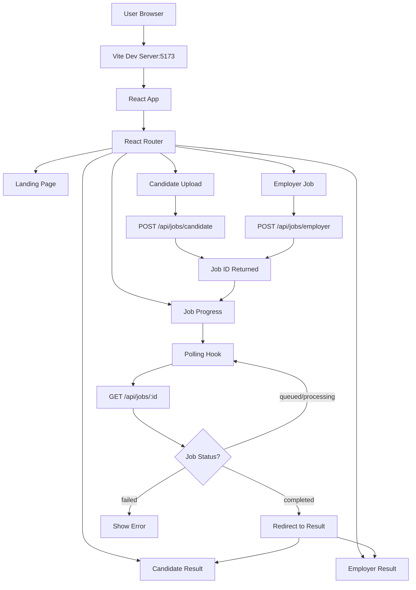

# Frontend UI Architecture Document (Revised)

## Executive Summary

The Frontend UI is a modern React application built with Vite, ShadCN UI components, and TypeScript. It implements a polling-based architecture to handle long-running AI operations asynchronously, providing real-time feedback to users while maintaining clean separation of concerns and excellent developer experience. This version includes enhanced result displays with skill breakdowns and expandable candidate cards.

---

## System Architecture Overview

### High-Level Flowchart



### Technology Stack

| Layer | Technology | Rationale |
|-------|-----------|-----------|
| **Framework** | React 18.3 | Industry standard, huge ecosystem |
| **Build Tool** | Vite 6.0 | Fast HMR, optimized production builds |
| **Language** | TypeScript 5.6 | Type safety, better DX |
| **Routing** | React Router 7.1 | Declarative routing, nested routes |
| **UI Library** | ShadCN UI | Accessible, customizable, Tailwind-based |
| **Styling** | Tailwind CSS 3.4 | Utility-first, responsive, dark mode |
| **State** | React useState | Local state sufficient (no Redux needed) |
| **Async** | Polling (useJobPolling hook) | Simple, no WebSockets needed |
| **Icons** | Lucide React | Lightweight, tree-shakeable |

---

## Project Structure

```
frontend/
├── src/
│   ├── pages/                    # Route components
│   │   ├── LandingPage.tsx       # Entry point with workflow selection
│   │   ├── CandidateUploadPage.tsx  # PDF upload interface
│   │   ├── EmployerJobPage.tsx   # JD submission interface
│   │   ├── JobProgressPage.tsx   # Real-time progress tracking
│   │   ├── CandidateResultPage.tsx  # Profile display
│   │   └── EmployerResultPage.tsx   # Ranked candidates display
│   ├── components/
│   │   └── ui/                   # ShadCN components
│   │       ├── button.tsx
│   │       ├── card.tsx
│   │       ├── progress.tsx
│   │       ├── badge.tsx
│   │       ├── textarea.tsx
│   │       └── label.tsx
│   ├── hooks/                    # Custom React hooks
│   │   └── useJobPolling.ts      # Job polling logic
│   ├── lib/                      # Utilities
│   │   ├── api.ts                # API client
│   │   └── utils.ts              # cn() helper
│   ├── types/                    # TypeScript types
│   │   └── index.ts              # Type definitions
│   ├── App.tsx                   # Root component
│   ├── main.tsx                  # Entry point
│   └── index.css                 # Global styles
├── package.json
├── vite.config.ts
├── tailwind.config.js
└── tsconfig.json
```

---

## Component Deep Dive

### 1. Landing Page

**File**: `src/pages/LandingPage.tsx`

#### Purpose
Entry point for demo users to choose workflow.

#### UI Structure

```tsx
<div className="min-h-screen bg-gradient...">
  <Container>
    <Header>Title + Description</Header>

    <Grid cols={2}>
      <Card onClick={() => navigate('/candidate')}>
        <Icon><FileText /></Icon>
        <Title>Process Candidate Resume</Title>
        <Description>Upload PDF → Extract profile</Description>
        <Button>Upload Resume</Button>
      </Card>

      <Card onClick={() => navigate('/employer')}>
        <Icon><Users /></Icon>
        <Title>Match Candidates to Job</Title>
        <Description>Submit JD → Find matches</Description>
        <Button>Find Candidates</Button>
      </Card>
    </Grid>
  </Container>
</div>
```

---

### 2. Candidate Upload Page

**File**: `src/pages/CandidateUploadPage.tsx`

#### State Management

```tsx
const [selectedFile, setSelectedFile] = useState<File | null>(null);
const [isSubmitting, setIsSubmitting] = useState(false);
const [error, setError] = useState<string | null>(null);
```

**Why Local State?**
- Single-use data (not shared across components)
- Simple enough for useState
- No need for Redux/Zustand

#### File Upload Flow

```tsx
<input
  type="file"
  accept=".pdf"
  onChange={handleFileSelect}
/>

{selectedFile ? (
  <FilePreview name={selectedFile.name} size={selectedFile.size} />
) : (
  <UploadPrompt />
)}
```

#### Validation

```tsx
const handleFileSelect = (e: React.ChangeEvent<HTMLInputElement>) => {
  const file = e.target.files?.[0];
  if (file) {
    if (!file.name.toLowerCase().endsWith('.pdf')) {
      setError('Please select a PDF file');
      setSelectedFile(null);
      return;
    }
    setError(null);
    setSelectedFile(file);
  }
};
```

---

### 3. Employer Job Page

**File**: `src/pages/EmployerJobPage.tsx`

#### Validation

```tsx
if (trimmed.length < 50) {
  setError('Job description must be at least 50 characters');
  return;
}
```

**Why 50 Character Minimum?**
- Prevents empty/meaningless submissions
- Ensures LLM has sufficient context
- Reduces failed jobs

#### Character Count Indicator

```tsx
<Textarea
  value={jobDescription}
  onChange={(e) => {
    setJobDescription(e.target.value);
    setError(null);
  }}
/>
<div className="text-right">
  {jobDescription.trim().length} characters (min. 50)
</div>
```

---

### 4. Job Progress Page

**File**: `src/pages/JobProgressPage.tsx`

#### The Polling Hook

**File**: `src/hooks/useJobPolling.ts`

```tsx
const POLL_INTERVAL = 2000; // 2 seconds

export function useJobPolling(jobId: string | null) {
  const [job, setJob] = useState<Job | null>(null);
  const [error, setError] = useState<string | null>(null);
  const intervalRef = useRef<number | null>(null);

  const poll = useCallback(async () => {
    if (!jobId) return;

    try {
      const data = await getJobStatus(jobId);
      setJob(data);

      // Stop polling on terminal states
      if (data.status === 'completed' || data.status === 'failed') {
        if (intervalRef.current) {
          clearInterval(intervalRef.current);
          intervalRef.current = null;
        }
      }

      if (data.status === 'failed') {
        setError(data.error_message || data.message);
      }
    } catch (err) {
      setError(err instanceof Error ? err.message : 'Failed to fetch');
      if (intervalRef.current) {
        clearInterval(intervalRef.current);
      }
    }
  }, [jobId]);

  useEffect(() => {
    if (!jobId) return;

    poll(); // Initial poll
    intervalRef.current = window.setInterval(poll, POLL_INTERVAL);

    return () => {
      if (intervalRef.current) {
        clearInterval(intervalRef.current);
      }
    };
  }, [jobId, poll]);

  return { job, error, isPolling: job?.status === 'processing' || job?.status === 'queued' };
}
```

#### Why Polling Instead of WebSockets?

| Approach | Pros | Cons | Our Choice |
|----------|------|------|------------|
| **Polling** | Simple, stateless, works everywhere | Slight latency | ✅ POC |
| **WebSockets** | Real-time, server push | Complex, stateful, scaling issues | ❌ Overkill |
| **SSE** | Server push, simpler than WS | One-way only | ❌ Not supported everywhere |

**Polling Parameters**:
```tsx
const POLL_INTERVAL = 2000; // 2 seconds
```

**Why 2 Seconds?**
- Fast enough for real-time feel
- Slow enough to avoid server overload
- Industry standard (GitHub Actions, Vercel, etc.)

#### Auto-Navigation

```tsx
useEffect(() => {
  if (job?.status === 'completed' && job?.type) {
    const targetPage = job.type === 'candidate'
      ? '/candidate/result'
      : '/employer/result';
    setTimeout(() => {
      navigate(`${targetPage}/${jobId}`, { replace: true });
    }, 500);
  }
}, [job?.status, job?.type, jobId, navigate]);
```

**Why 500ms Delay?**
- User sees "100%" briefly
- Smooth transition feeling
- Prevents jarring redirects

---

### 5. Candidate Result Page

**File**: `src/pages/CandidateResultPage.tsx`

#### Purpose
Display extracted candidate profile from AI processing.

#### Identity Card

```tsx
<Card>
  <CardHeader>
    <div className="flex items-center gap-4">
      <Avatar icon={<User />} />
      <div>
        <CardTitle>{profile.identity.full_name}</CardTitle>
        <CardDescription>Candidate Profile</CardDescription>
      </div>
    </div>
    <div className="flex gap-2">
      {profile.identity.linkedin && <Badge><Linkedin /> LinkedIn</Badge>}
      {profile.identity.github && <Badge><Github /> GitHub</Badge>}
    </div>
  </CardHeader>
</Card>
```

#### Experience Timeline

```tsx
{profile.candidate_roles.map((role, idx) => (
  <Card key={idx}>
    <CardHeader>
      <CardTitle>{role.title}</CardTitle>
      <CardDescription>
        <Calendar /> {role.verified_duration} months verified
      </CardDescription>
    </CardHeader>
    <CardContent>
      <Section>
        <Heading><Code /> Technologies</Heading>
        <Flex wrap>
          {role.raw_technologies.map(tech => (
            <Badge key={tech} variant="secondary">{tech}</Badge>
          ))}
        </Flex>
      </Section>

      <Section>
        <Heading><Globe /> Domains</Heading>
        <Flex wrap>
          {role.domains.map(domain => (
            <Badge key={domain} variant="outline">{domain}</Badge>
          ))}
        </Flex>
      </Section>
    </CardContent>
  </Card>
))}
```

---

### 6. Employer Result Page (ENHANCED)

**File**: `src/pages/EmployerResultPage.tsx`

#### NEW Features

1. **Expandable Candidate Cards**: View detailed skill breakdowns
2. **Skill Breakdown Display**: Per-skill contribution visualization
3. **Role Context Display**: Shows matching domain and seniority
4. **Enhanced Match Indicators**: Confidence icons and colors

#### Expandable Cards

```tsx
const [expandedCards, setExpandedCards] = useState<Set<number>>(new Set());

const toggleCard = (idx: number) => {
  const newExpanded = new Set(expandedCards);
  if (newExpanded.has(idx)) {
    newExpanded.delete(idx);
  } else {
    newExpanded.add(idx);
  }
  setExpandedCards(newExpanded);
};
```

#### Candidate Card with Skill Breakdown

```tsx
<Card key={idx}>
  <CardHeader className="bg-muted/50">
    <div className="flex justify-between">
      <div className="flex items-center gap-4">
        <Rank>{idx + 1}</Rank>
        <div>
          <CardTitle>{candidate.name}</CardTitle>
          <CardDescription>
            {getConfidenceIcon(candidate.confidence)}
            {candidate.confidence}
          </CardDescription>
        </div>
      </div>
      <Score>{Math.round(candidate.score)}%</Score>
    </div>
  </CardHeader>

  <CardContent>
    <Progress value={candidate.score} />

    {/* Quick skill badges */}
    <SkillBadges>
      {candidate.matches.map(match => (
        <Badge
          key={match}
          variant={isVerified(match) ? 'default' : 'secondary'}
          className={isVerified(match) ? 'bg-green-500/20' : ''}
        >
          {match}
        </Badge>
      ))}
    </SkillBadges>

    {/* Expandable detailed breakdown */}
    {expandedCards.has(idx) && (
      <SkillBreakdown>
        {candidate.skill_breakdown.map((skill, skillIdx) => (
          <SkillDetail key={skillIdx}>
            <SkillName>{skill.skill_name}</SkillName>
            <SkillMetrics>
              <Metric>
                <Label>Contribution:</Label>
                <Value>{skill.contribution_to_total.toFixed(1)}%</Value>
              </Metric>
              <Metric>
                <Label>Experience:</Label>
                <Value>{skill.experience_months} months</Value>
              </Metric>
              <Metric>
                <Label>Last Used:</Label>
                <Value>{skill.last_used_date}</Value>
              </Metric>
              <Metric>
                <Label>Weight:</Label>
                <Value>{skill.weight.toFixed(2)}x</Value>
              </Metric>
              <Metric>
                <Label>Recency:</Label>
                <Value>{skill.recency_score.toFixed(2)}</Value>
              </Metric>
              <Metric>
                <Label>Competency:</Label>
                <Value>{skill.competency_score.toFixed(0)}%</Value>
              </Metric>
            </SkillMetrics>
          </SkillDetail>
        ))}
      </SkillBreakdown>
    )}

    {/* Expand/Collapse button */}
    <Button
      variant="ghost"
      size="sm"
      onClick={() => toggleCard(idx)}
      className="mt-4"
    >
      {expandedCards.has(idx) ? (
        <>
          <ChevronUp /> Hide Details
        </>
      ) : (
        <>
          <ChevronDown /> Show Details
        </>
      )}
    </Button>
  </CardContent>
</Card>
```

#### Role Context Display

```tsx
const formatRoleContext = (roleContext: string | Record<string, string>): string => {
  if (typeof roleContext === 'string') {
    return roleContext;
  }
  // It's an object with primary_domain and seniority_level
  const domain = roleContext.primary_domain || 'General';
  const seniority = roleContext.seniority_level || '';
  return seniority ? `${seniority} ${domain}` : domain;
};

// Usage
<div className="flex items-center gap-2">
  <Briefcase />
  <span>Matching for: <span className="font-medium">
    {formatRoleContext(result.role_context)}
  </span></span>
</div>
```

---

## TypeScript Type Definitions

**File**: `src/types/index.ts`

```typescript
export type JobType = 'candidate' | 'employer';
export type JobStatus = 'queued' | 'processing' | 'completed' | 'failed';

export interface Job {
  id: string;
  type: JobType;
  status: JobStatus;
  progress: number;
  message: string;
  result?: any;
  created_at: string;
  error_message?: string;
}

export interface CandidateIdentity {
  full_name: string;
  linkedin?: string;
  github?: string;
}

export interface CandidateRole {
  title: string;
  verified_duration: number;
  raw_technologies: string[];
  domains: string[];
}

export interface CandidateProfile {
  identity: CandidateIdentity;
  candidate_roles: CandidateRole[];
}

export interface SkillBreakdown {
  skill_name: string;
  match_type: string;
  type: string;
  last_used_date: string;
  weight: number;
  experience_months: number;
  recency_score: number;
  competency_score: number;
  contribution_to_total: number;
}

export interface MatchCandidate {
  name: string;
  candidate_id: number;
  score: number;
  matches: string[];
  confidence: string;
  skill_breakdown: SkillBreakdown[];
  total_jd_skills: number;
  matched_skill_count: number;
  unmatched_skill_count: number;
}

export interface EmployerResult {
  matches: MatchCandidate[];
  role_context: string | Record<string, string>;
}
```

---

## API Client

**File**: `src/lib/api.ts`

```typescript
const API_BASE = '/api';  // Vite proxy to backend

export async function submitCandidateJob(file: File): Promise<string> {
  const formData = new FormData();
  formData.append('file', file);

  const response = await fetch(`${API_BASE}/jobs/candidate`, {
    method: 'POST',
    body: formData,
  });

  if (!response.ok) {
    const error = await response.json();
    throw new Error(error.detail || 'Failed to submit job');
  }

  const data = await response.json();
  return data.job_id;
}

export async function submitEmployerJob(jobDescription: string): Promise<string> {
  const response = await fetch(`${API_BASE}/jobs/employer`, {
    method: 'POST',
    headers: { 'Content-Type': 'application/json' },
    body: JSON.stringify({ job_description: jobDescription }),
  });

  if (!response.ok) {
    const error = await response.json();
    throw new Error(error.detail || 'Failed to submit job');
  }

  const data = await response.json();
  return data.job_id;
}

export async function getJobStatus(jobId: string) {
  const response = await fetch(`${API_BASE}/jobs/${jobId}`);

  if (!response.ok) {
    throw new Error('Failed to get job status');
  }

  return response.json();
}
```

### Vite Proxy Configuration

**File**: `vite.config.ts`

```typescript
export default defineConfig({
  server: {
    port: 5173,
    proxy: {
      '/api': {
        target: 'http://localhost:8000',
        changeOrigin: true,
        rewrite: (path) => path.replace(/^\/api/, ''),
      },
    },
  },
});
```

**Benefits**:
1. **No CORS Issues**: Frontend and backend on different ports
2. **Clean URLs**: `/api/jobs/123` instead of `http://localhost:8000/jobs/123`
3. **Development Ease**: Works in dev, easy to switch to prod

---

## Routing Architecture

**File**: `src/App.tsx`

```tsx
<BrowserRouter>
  <Routes>
    <Route path="/" element={<LandingPage />} />
    <Route path="/candidate" element={<CandidateUploadPage />} />
    <Route path="/employer" element={<EmployerJobPage />} />
    <Route path="/progress/:jobId" element={<JobProgressPage />} />
    <Route path="/candidate/result/:jobId" element={<CandidateResultPage />} />
    <Route path="/employer/result/:jobId" element={<EmployerResultPage />} />
    <Route path="*" element={<Navigate to="/" replace />} />
  </Routes>
</BrowserRouter>
```

### URL Design

| Route | Purpose | Params | Example |
|-------|---------|--------|---------|
| `/` | Landing | None | Home |
| `/candidate` | Upload form | None | Upload resume |
| `/employer` | JD form | None | Submit JD |
| `/progress/:jobId` | Status | `jobId` | Track job |
| `/candidate/result/:jobId` | Candidate result | `jobId` | View profile |
| `/employer/result/:jobId` | Employer result | `jobId` | View matches |

**Why URL Parameters?**
1. **Shareable Results**: Send link to specific job result
2. **Browser History**: Back button works correctly
3. **Refresh-Safe**: Reload page, still see results
4. **Bookmarkable**: Save interesting results

---

## UI Components (ShadCN)

### Why ShadCN UI?

| Criteria | ShadCN | MUI | Chakra | Headless UI |
|----------|--------|-----|--------|-------------|
| **Bundle Size** | ✅ Copy-paste (0 deps) | ❌ 300KB+ | ❌ 200KB+ | ✅ Lightweight |
| **Customization** | ✅ You own the code | ⚠️ Theme overrides | ⚠️ Theme overrides | ✅ Full control |
| **Accessibility** | ✅ Radix primitives | ✅ Good | ✅ Good | ✅ Radix primitives |
| **Design** | ✅ Tailwind-based | ❌ Custom CSS | ❌ Custom CSS | ⚠️ Bring your own |
| **Updates** | ✅ Manual (controlled) | ⚠️ Auto-breaking | ⚠️ Auto-breaking | ✅ Manual |

---

## Performance Optimizations

### 1. Code Splitting (React Router)

```tsx
// Lazy load pages (future enhancement)
const CandidateResultPage = lazy(() => import('./pages/CandidateResultPage'));
```

### 2. Polling Optimization

```tsx
useEffect(() => {
  const interval = setInterval(poll, POLL_INTERVAL);
  return () => clearInterval(interval);  // Cleanup
}, [jobId]);
```

**Prevents**:
- Memory leaks
- Multiple intervals
- Unnecessary API calls

### 3. Memoization (Potential)

```tsx
const CandidateCard = React.memo(({ candidate }: { candidate: MatchCandidate }) => {
  // Only re-renders if candidate changes
});
```

---

## Key Features Summary

| Feature | Implementation |
|---------|----------------|
| **Real-Time Progress** | Polling hook (2s interval) |
| **File Upload** | Drag & drop + validation |
| **JD Submission** | Character count + validation |
| **Results Display** | Cards with expandable details |
| **Skill Breakdown** | Per-skill contribution metrics |
| **Type Safety** | Full TypeScript coverage |
| **Responsive Design** | Mobile-first Tailwind CSS |
| **Accessibility** | Semantic HTML + ARIA labels |
| **Error Handling** | User-friendly error messages |
| **Navigation** | Auto-redirect on completion |

---

## File Count & Lines of Code

| Directory | Files | Lines | Purpose |
|-----------|-------|-------|---------|
| `pages/` | 6 | ~1,000 | User-facing screens |
| `components/ui/` | 6 | ~400 | Reusable UI primitives |
| `hooks/` | 1 | ~70 | Job polling logic |
| `lib/` | 2 | ~130 | API & utilities |
| `types/` | 1 | ~60 | Type definitions |
| **Total** | **16** | **~1,660** | Complete application |

---

## Key Improvements from Previous Version

| Feature | Previous | Current |
|---------|----------|---------|
| **Employer Results** | Basic candidate list | Expandable cards with details |
| **Skill Display** | Simple badges | Full breakdown with metrics |
| **Role Context** | String only | Object with domain/seniority |
| **Match Confidence** | Text label | Icon + color + badge |
| **Progress Tracking** | Basic | Enhanced with status icons |
| **Error Handling** | Basic errors | Detailed error messages |
| **Type Safety** | Partial | Full TypeScript coverage |

---

## Conclusion

The Frontend UI achieves its goals through:
1. **React + Vite**: Fast development, optimized production builds
2. **ShadCN UI**: Beautiful, accessible components without bloat
3. **Polling Architecture**: Simple, reliable async job handling
4. **TypeScript**: Type-safe, refactorable code
5. **Tailwind CSS**: Responsive, consistent styling
6. **Enhanced Displays**: Skill breakdowns, expandable cards
7. **Clean Architecture**: Separation of concerns, single responsibility

The result is a professional, performant, and maintainable UI that effectively showcases the ATS capabilities with rich result visualizations.

---

## Document Authors

- **Architecture**: Generated by Claude (Anthropic)
- **Codebase**: ATS Web Application (Revised)
- **Date**: January 2026
- **Version**: 2.0.0
